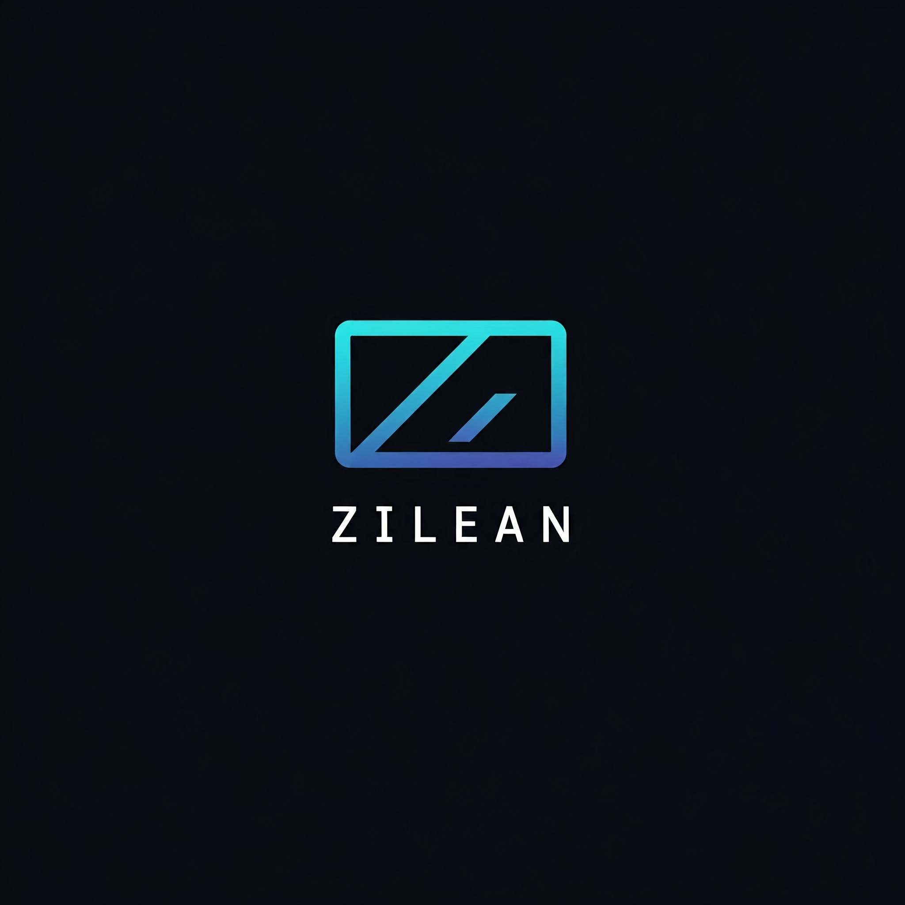

# What is Zilean

Zilean is a service that allows you to search for [DebridMediaManager](https://github.com/debridmediamanager/debrid-media-manager) sourced content shared by users.
This can then be configured as a Torznab indexer in your favorite content application.
Newly added is the ability for Zilean to scrape from your running Zurg instance, and from other running Zilean instances.

Documentation for zilean can be viewed at [https://ipromknight.github.io/zilean/](https://ipromknight.github.io/zilean/)

---

Fancy getting a new provider for your filesharing needs?

Consider getting Torbox using my referral link me :)

