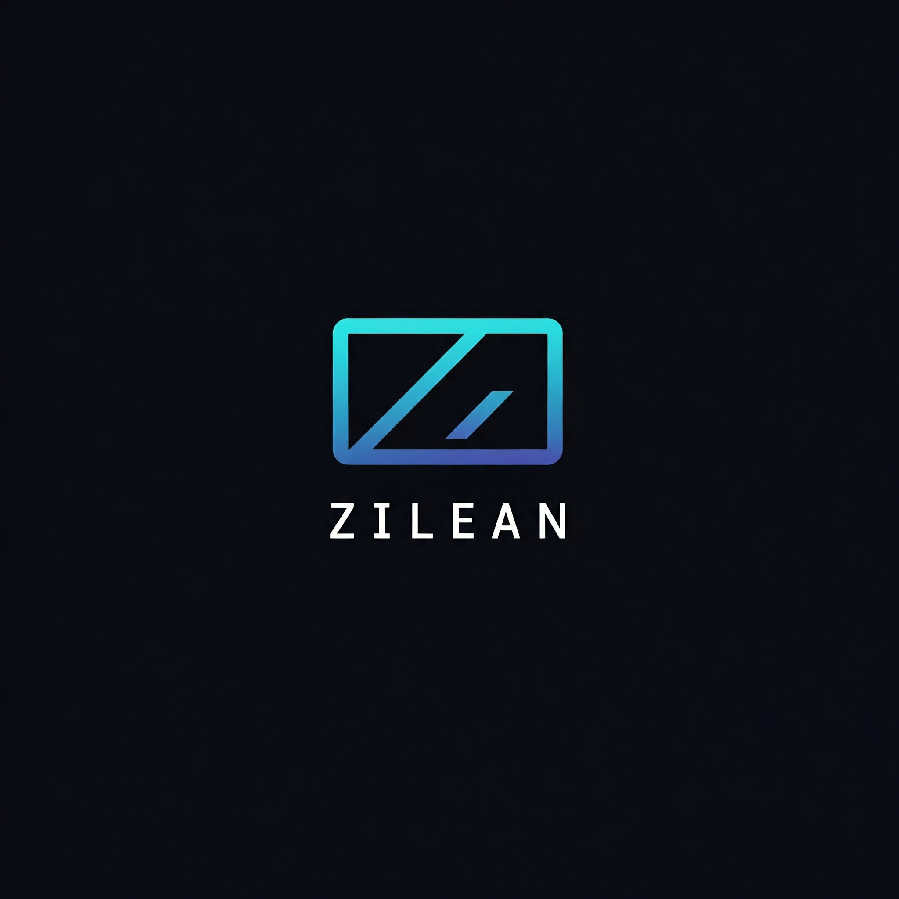

# What is Zilean



Zilean is a service that allows you to search for [DebridMediaManager](https://github.com/debridmediamanager/debrid-media-manager) sourced content shared by users.
This can then be configured as a Torznab indexer in your favorite content application.
Newly added is the ability for Zilean to scrape from your running Zurg instance, and from other running Zilean instances.

Documentation for zilean can be viewed at [https://ipromknight.github.io/zilean/](https://ipromknight.github.io/zilean/)

---

## Requirements

- **PostgreSQL 16+** with the `pg_trgm` extension enabled
- **No Elasticsearch** — Zilean uses PostgreSQL trigram indexes for fuzzy search, not Elasticsearch
- Docker (recommended) or .NET 9 SDK for building from source
- Python 3.11 (bundled in the Docker image)

## Security

- **Never expose the PostgreSQL database to the public internet.** Zilean's Postgres instance should only be accessible from the Zilean container and trusted internal services.
- Use the `X-API-KEY` header for API authentication. An API key is auto-generated on first run and written to the settings file.
- If running behind a reverse proxy, ensure the proxy does not expose internal endpoints unintentionally.

## Resource Usage

Zilean's initial sync (DMM scrape + IMDB metadata import) is resource-intensive by design:

- **CPU**: Will spike to high usage during the first sync as torrents are parsed, deduplicated, and inserted. This is normal and settles down after the initial import.
- **Memory**: Expect 1-2 GB RAM usage during initial sync. Steady-state usage is much lower.
- **Disk**: The PostgreSQL database will grow to several GB depending on the number of indexed torrents.
- **Duration**: The first sync can take 30-60 minutes depending on hardware. Subsequent syncs are incremental and fast.

Do not restart the container during initial sync — let it complete.

## Multi-Instance Deployment

Zilean supports scraping from other running Zilean instances via the `GenericEndpoints` configuration. This allows you to:

- Run multiple Zilean instances that share discovered content
- Point a new instance at an existing one to bootstrap its database
- Aggregate results from multiple sources

Configure additional instances in `data/settings.json` under the `Zilean.Ingestion.GenericEndpoints` array:

```json
{
  "Zilean": {
    "Ingestion": {
      "GenericEndpoints": [
        {
          "Url": "http://other-zilean:8181/torrents/all",
          "EndpointType": "Zilean",
          "Cron": "0 */6 * * *"
        }
      ]
    }
  }
}
```

## Health Checks

Zilean exposes a health check endpoint for monitoring and orchestration:

- `GET /healthchecks/ping` — Returns a timestamped pong response. Useful for liveness probes.

Example Docker Compose healthcheck:

```yaml
healthcheck:
  test: ["CMD", "curl", "-f", "http://localhost:8181/healthchecks/ping"]
  interval: 30s
  timeout: 10s
  retries: 3
  start_period: 60s
```

## Troubleshooting

### Container exits immediately on startup
- Check that PostgreSQL is reachable and the connection string is correct
- Ensure the `data/` directory is writable by the container
- Review logs with `docker logs zilean --tail 100`

### High CPU/memory during operation
- This is expected during initial sync — see [Resource Usage](#resource-usage) above
- If it persists after initial sync, check the configured cron schedules for scraping frequency

### Search returns no results
- Verify the initial DMM sync has completed (check logs for the summary table output)
- Ensure `pg_trgm` extension is enabled in PostgreSQL
- Check that the IMDB data import completed successfully

### API key issues
- The API key is auto-generated on first run and stored in `data/settings.json`
- To reset it, stop the container, edit the settings file, and restart

---


<a href='https://ko-fi.com/W7W616IBNG' target='_blank'></a>
